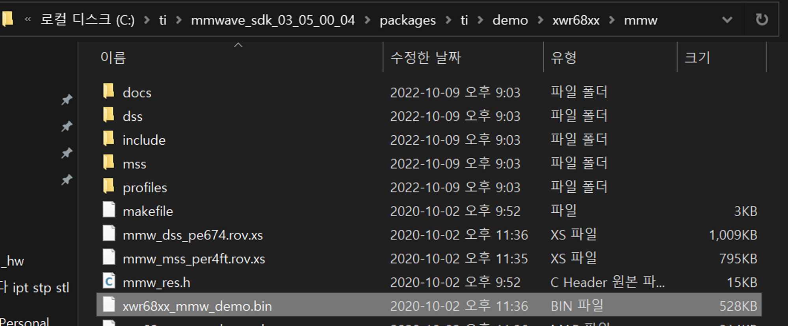

# TI mmWave ROS 2 Package (Customized)

> Radar can overcome some cases that other sensors cannot. Such as transparent, metalic objects, dark and rainy area. TI's mmWave is cheap, stable, and powerful sensor for radar sensing. And this package is made for ROS 2 compatibility for that.

<p align="center">
    
    
</p>

## Quick start guide

1. Mount your mmWave device with power supply and connect a micro-USB cable to host machine with ROS 2. This pkg is vertified in below systems

* Ubuntu 18.04 & ROS 2 eloquent
* Ubuntu 20.04 & ROS 2 foxy
* NVIDIA Jetpack 4 & ROS 2 eloquent

> Here's example of mount (designed by Jong Meung Lee)

<p align="center">
    
</p>


2. Download SDK 3.0 or above from [here](http://www.ti.com/tool/MMWAVE-SDK) and use [UNIFLASH](http://www.ti.com/tool/UNIFLASH) to flash xwrXXXX_mmw_demo.bin to your device. **Do not forget SOP2 jumper when flashing.**

<p align="center">
    
</p>

> I recommend to check with [Demo Visualizer](https://dev.ti.com/gallery/view/mmwave/mmWave_Demo_Visualizer/ver/3.6.0/) before launching ROS 2 demo

3. Install apt Dependencies 

```bash
# install linux pkgs
sudo apt-get install libpthread-stubs0-dev
sudo apt install ros-eloquent-perception-pcl -y
sudo apt install ros-eloquent-composition -y
```

4. Clone this repo and build ROS 2 packages
  
```bash
# cd `<workspace dir>/src`
git clone https://github.com/kimsooyoung/mmwave_ti_ros.git

# pkg build
colcon build --symlink-install --packages-select serial
source install/local_setup.bash

colcon build --symlink-install --packages-select ti_mmwave_ros2_interfaces
source install/local_setup.bash

colcon build --symlink-install --packages-select ti_mmwave_ros2_pkg
source install/local_setup.bash

# For this package, pcl common is required, But don't be afraid, ROS Installing contains PCL
colcon build --symlink-install --packages-select ti_mmwave_ros2_examples
source install/local_setup.bash
```

If Boost error occurs during building, check your boost version with correct symbolic link (ref by [stackoverflow](https://stackoverflow.com/questions/18200300/undefined-reference-to-boostsystemgeneric-category))

```bash
# check boost version
cat /usr/include/boost/version.hpp | grep "BOOST_LIB_VERSION"
# symbolic link reconfigure 
sudo ln -s /usr/lib/aarch64-linux-gnu/libboost_system.so.1.65.1 /usr/lib/libboost_system.so
```

5. Enable command and data ports on Linux:

```bash
# validate usb connection
$ ls -l /dev/ | grep mmWave
mmWave_00ED33DD_00 -> ttyUSB0
mmWave_00ED33DD_01 -> ttyUSB1

# give permission to usb pins
sudo chmod 666 /dev/ttyUSB0
sudo chmod 666 /dev/ttyUSB1
```

> Note: If multiple sensors are used, enable additional ports `/dev/ttyACM2` and `/dev/ttyACM3`, etc. the same as this step.

6. Launch ROS 2 Command

```bash
ros2 launch ti_mmwave_ros2_pkg eloquent_composition.launch.py
```

> Bad news. Main node uses pthread instead of ROS 2 lifecycle. Therefore, you must kill process manually for clearly exit program.

```bash
kill -9 \`ps faux | grep ti_mmwave_ros2_ | awk '{print $2}'\`
kill -9 \`ps faux | grep component | awk '{print $2}'\`
```

---

### Based on updates from Dr. Leo Zhang (University of Arizona)

| Contributor  | Updated Content |
| ------------- | ------------- |
| Kim Soo Young  | Add support for ROS 2. SDK version: 3.5.0.4.  |
| Dr. Zhang  | Add support for XWR18XX devices. SDK version: 3.2.0.4.  |
| Allison Wendell  | Add support for XWR68XX devices. SDK version: 3.2.0.4 |

> Initially derived from TI's origin ROS package in Industrial Toolbox 2.3.0 (new version available [Industrial Toolbox 2.5.2](http://dev.ti.com/tirex/#/?link=Software%2FmmWave%20Sensors%2FIndustrial%20Toolbox)).

---

### Differences from origin TI's version:
1. Added all radar parameters from calculations and can be read from `rosparam get`.
2. Added Doppler data from detecting targets and form a customized ROS message `/ti_mmwave/radar_scan`.
3. Added support for multiple radars working together.
4. Added support for camera overlay (for sensor fusion).
5. Working with xWR1443 and xWR1642 ES1.0 and ES2.0 (ES1.0 is deprecated from TI)
   

### Available devices:
- TI mmWave xWR1443BOOST
- TI mmWave xWR1642BOOST
- TI mmWave xWR1642BOOST ES2.0/3.0 EVM (not tested)
- TI mmWave xWR1642BOOST ES2.0 EVM
- TI mmWave AWR1843BOOST ES1.0 EVM
- TI mmWave IWR6843ISK ES1.0 EVM **(verified)**
---
### Message format:
```
header: 
  seq: 6264
  stamp: 
    secs: 1538888235
    nsecs: 712113897
  frame_id: "ti_mmwave"   # Frame ID used for multi-sensor scenarios
point_id: 17              # Point ID of the detecting frame (Every frame starts with 0)
x: 8.650390625            # Point x coordinates in m (front from antenna)
y: 6.92578125             # Point y coordinates in m (left/right from antenna, right positive)
z: 0.0                    # Point z coordinates in m (up/down from antenna, up positive)
range: 11.067276001       # Radar measured range in m
velocity: 0.0             # Radar measured range rate in m/s
doppler_bin: 8            # Doppler bin location of the point (total bins = num of chirps)
bearing: 38.6818885803    # Radar measured angle in degrees (right positive)
intensity: 13.6172780991  # Radar measured intensity in dB
```
---
### Troubleshooting
1.
```
mmWaveCommSrv: Failed to open User serial port with error: IO Exception (13): Permission denied
mmWaveCommSrv: Waiting 20 seconds before trying again...
```
This happens when serial port is called without superuser permission, do the following steps:
```
sudo chmod 666 /dev/ttyACM0
sudo chmod 666 /dev/ttyACM1
```
2.
```
mmWaveQuickConfig: Command failed (mmWave sensor did not respond with 'Done')
mmWaveQuickConfig: Response: 'sensorStop
'?`????`????`???~' is not recognized as a CLI command
mmwDemo:/>'
```
When this happens, re-run the command you send to sensor. If it continues, shut down and restart the sensor.

3.
```
terminate called after throwing an instance of 'serial::SerialException'
```
This means unstable serial connection, change use cable or hub.
---
### Multiple devices support (dual AWR1642 ES2.0 EVM):
1. Connect two devices and try `ll /dev/serial/by-id` or `ls /dev`. In this case, `/dev/ttyACM0` to `/dev/ttyACM3` should shown.
2. To avoid serial port confliction, you need to launch devices separately. So for first device (it will open rviz):

```
roslaunch ti_mmwave_rospkg multi_1642_0.launch 
```
3. Change radars' location in first six arguments `<node pkg="tf" type="static_transform_publisher" name="radar_baselink_0" args="0 0 0 0 0 0 ti_mmwave_pcl ti_mmwave_0 100"/>` (stands for x,y,z for positions in meters and yaw, pitch, roll for angles in radians) in launch file `multi_1642_1.launch`. And launch second device:

```
roslaunch ti_mmwave_rospkg multi_1642_1.launch 
```

Note: As serial connection and the original code, you need to launch devices separately using different launch files.

---
### Camera overlay support (working with USB camera or CV camera):
1. Download and build USB camera repo [here](https://github.com/radar-lab/usb_webcam`). And set parameters of camera in `<usb_webcam dir>/launch/usb_webcam.launch`.
2. To test the device image working, try:
```
roslaunch usb_webcam usb_webcam.launch
rosrun rqt_image_view rqt_image_view  
```
3. Make sure you have done [ROS camera calibration](http://wiki.ros.org/camera_calibration) and create a `*.yaml` configuration file accordingly.
4. Launch radar-camera system using:
```
roslaunch ti_mmwave_rospkg camera_overlay.launch
```
