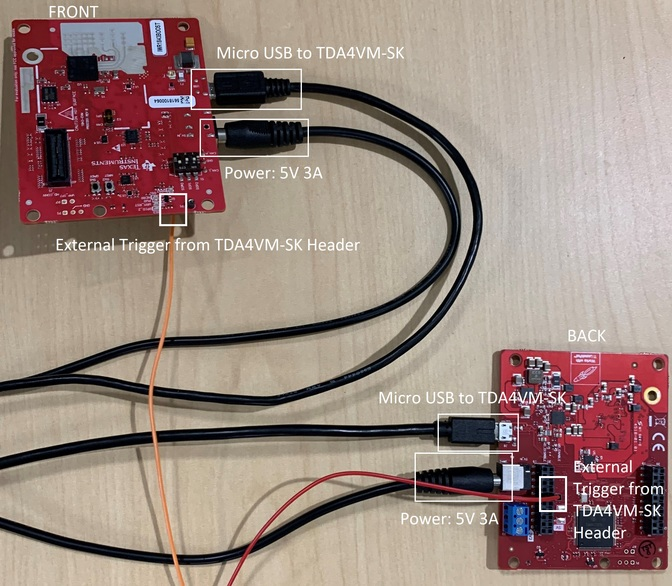
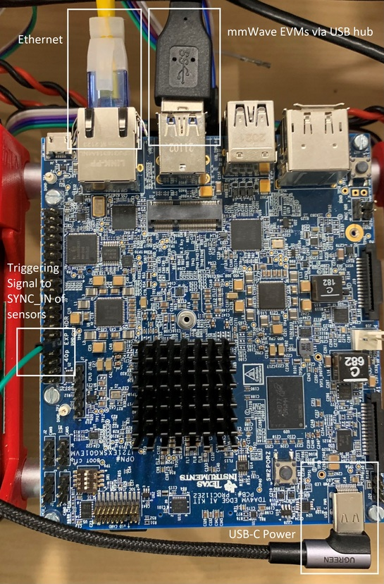

Time Sync of Frames from Multiple Sensors
=========================================

The purpose for this page is to document two methods to enable synchronization in time for frames from multiple TI mmWave radar devices with the ROS radar driver. Time based synchronization can be very useful for applications in which data from multiple sensors is used. 

In this scenario four (4) of TI's mmWave EVM's are connected to a host machine via USB. It is assumed that all of the sensors are flashed and running the exact same firmware. 

# Software Based Method

The software based approach is very simple and enables coarse synchronization (1ms) among frames from multiple mmWave devices for a period of time. It works by configuring all sensors, waiting to send the start command to each device until all devices are fully configured. At that point the start command is sent to each device with an optional user defined delay value between subsequent start commands. The delay can be used to offset frames from different radars in time. One of the limitations of this approach is that the triggering of each frame following the first frame, for each sensor, is controlled by that sensor's own clock. Because of slight variations, over a long period of time, the timing of the frames for one device may become out of sync with that of another. 

# Hardware Based Method

**Note**: The hardware sync method applies only when the host machine is TI's [SK-TDA4VM](https://www.ti.com/tool/SK-TDA4VM). It is also assumed that the setup of the Robotics SDK and Docker container is complete. If this has not been completed, follow the instructions [here](https://software-dl.ti.com/jacinto7/esd/robotics-sdk/08_02_00/docs/source/docker/README.html).

This approach utilizes the GPIO PWM functionality on the SK-TDA4VM to generate a triggering signal. The mmWave devices can be configured for HW Trigger mode which means that each frame is triggered at the rising edge of a pulse signal fed into the SYNC_IN pin. The mmWave devices can also be configured with a trigger delay, which allows for the triggering of frames for multiple radars to be offset from one another. This can be beneficial in reducing the probability of seeing "ghost targets" caused by parallel interference.

This approach has clear advantages in terms of time synchronization. This is because the triggering of frames for all the connected sensors is controlled by a single source. Also, assuming an equal length for the path of the triggering pulse signal to each sensor, the sensors all recieve the signal at the same instant.

**Note**: HW based synchronization was tested with TI's IWR1843BOOST EVM due to the SYNC_IN pin being accessible without board modification. Modification may be required in order to access the SYNC_IN pin on other EVMs.

# Using the mmWaveSync node 

## SW based synchronization
To use the SW based sync, launch the driver with `sw_sync_quad_sensor.launch`. Below is the part of the launch file relating to the sync node.
```
<node pkg="ti_mmwave_rospkg" type="mmWaveSync" name="mmWaveSync" ns="ti_mmwave_sync" output="screen">
    <param name="sync_type" value="SW" />
    <param name="num_sensors" value="4" />
    <param name="trigger_delay" value="0" />
    <param name="serial_ports" value="/dev/ttyACM0 /dev/ttyACM2" />
    <param name="config_file" value="$(find ti_mmwave_rospkg)/cfg/6843_3d.cfg" />
</node>
```

## HW based synchronization
The hardware based synchronization method requires the ti-gpio-cpp package. Run the following on the TDA4 host linux:
```
git clone https://github.com/TexasInstruments/ti-gpio-cpp.git
mkdir -p ti-gpio-cpp/build && cd ti-gpio-cpp/build
cmake ..
make
make install
```

The hardware synchronization method requires that a signal is fed from a pin on the 40-pin header on the SK board to the SYNC_IN pin on all of the connected sensors. On the xWR1843BOOST evm the SYNC_IN pin can be accessed via pin 9 of J6. For other devices, use the schematics to find where the SYNC_IN pin can be accessed.



Figure 1. Radar Connections for HW Sync.



Figure 2. SK Board Connections for HW Sync.

By default, the 40-pin header is not enabled on TDA4VM SK board. This can be enabled by specifying the dtb overlay file `k3-j721e-sk-rpi-exp-header.dtbo` in `/run/media/mmcblk0p1/uenv.txt` as given below:
```
name_overlays=k3-j721e-edgeai-apps.dtbo k3-j721e-sk-rpi-exp-header.dtbo 
```

To use the HW based sync, launch the driver with `hw_sync_quad_sensor.launch`. Below is the part of the launch file relating to the sync node.
```
<node pkg="ti_mmwave_rospkg" type="mmWaveSync" name="mmWaveSync" ns="ti_mmwave_sync" output="screen">
    <param name="sync_type" value="HW" />
    <param name="num_sensors" value="4" />
    <param name="pwm_pin" value="32" />
    <param name="pulse_freq" value="10" />
    <param name="duty_cycle" value="1" />
    <param name="trigger_delay" value="0" />
    <param name="config_file" value="$(find ti_mmwave_rospkg)/cfg/1843_3d_hw_trig.cfg" />
</node>
```

**Note**: For HW based sync, user must define valid parameters for triggering pulse generation:
* Pulse periodicity should be greater than the sum of the frame period and the trigger_delay
* Pulse width must be greater than 25ns
* HW PWM pins on SK-TDA4VM are {29, 31, 32, 33}

## mmWaveSync Parameters

### Common Parameters
Parameter | Description | Value
----------|-------------|------
sync_type | Select synchronization type | "SW", "HW", "none"
num_sensors | Total number of mmWave sensors connected to Host | int
trigger_delay | Duration in ms to offset the start of each frame from sensor to sensor | float
config_file | Path to cfg file used to configure sensors | string

### SW Parameters
Parameter | Description | Value
----------|-------------|------
serial_ports | list of serial ports (com_user) for each device | string (each port should be separated by a space)

### HW Parameters
Parameter | Description | Value
----------|-------------|------
pwm_pin | GPIO pin from 40-pin header on SK-TDA4VM used to generate triggering pulse | int
pulse_freq | Frequency of the triggering pulse in Hz | int
duty_cycle | Duty cycle percentage of the triggering pulse | float

## Limitations

* For SW based synchronization, actual delay value will be accurate to +-1ms
* Known issue for SW based sync where radar's first frame will take much longer than expected voiding synchronization
* `trigger_delay` for HW based sync is limmited to a max of 100us due to device firmware constraints. It may be possible to increase this maximum by modifying the firmware flashed to the device.
* HW based sync requires that the SYNC_IN pin be acessible on the TI mmWave device. Some EVMs may require modification to access the SYNC_IN pin.
